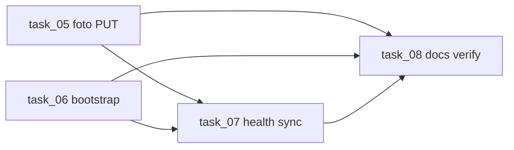

# middleware-biodoc-intelbras — Task List

## Fase 1 — Implementação inicial (concluída)

| # | Title | Status | Complexity | Dependencies |
|---|-------|--------|------------|--------------|
| 01 | Configuração Base (FastAPI, Logs e Banco de Dados SQLite) | completed | medium | — |
| 02 | Autenticação e Endpoint de Sincronização (Auth Manager) | completed | medium | task_01 |
| 03 | Integração Defense IA e Token Persistente (Keep-Alive) | completed | high | task_02 |
| 04 | Lógica de Sincronização e Tratamento de Erros | completed | medium | task_03 |

## Fase 2 — Produção: `/v1/person/sync` para BIODOC

Objetivo: contrato estável na URL do middleware, token BIODOC via `.env`, token Defense automático (já existente), **não apagar foto** em update sem imagem.

| # | Title | Status | Complexity | Dependencies |
|---|-------|--------|------------|--------------|
| 05 | Preservar foto no PUT quando BIODOC não envia biometrics | completed | medium | task_04 |
| 06 | Bootstrap automático do source BIODOC (integration_key via .env) | completed | medium | task_01 |
| 07 | Health check operacional e endurecimento da rota /v1/person/sync | completed | low | task_05, task_06 |
| 08 | Documentação e verificação final do fluxo produção BIODOC | completed | low | task_05, task_06, task_07 |

### Ordem recomendada de execução



1. **task_05** e **task_06** podem ser feitas em paralelo.
2. **task_07** após 05 e 06.
3. **task_08** por último (docs + smoke + marcar checkboxes).

### Contrato BIODOC (referência rápida)

| Request | Defense |
|---------|---------|
| POST, sem `biometrics` | Cadastro sem foto |
| PUT, sem `biometrics` | Atualiza dados; **mantém** foto |
| Com `biometrics.face_image_base64` | Cria ou substitui foto |

```http
POST {MIDDLEWARE_URL}/v1/person/sync
Authorization: Bearer {BIODOC_INTEGRATION_KEY}
```
